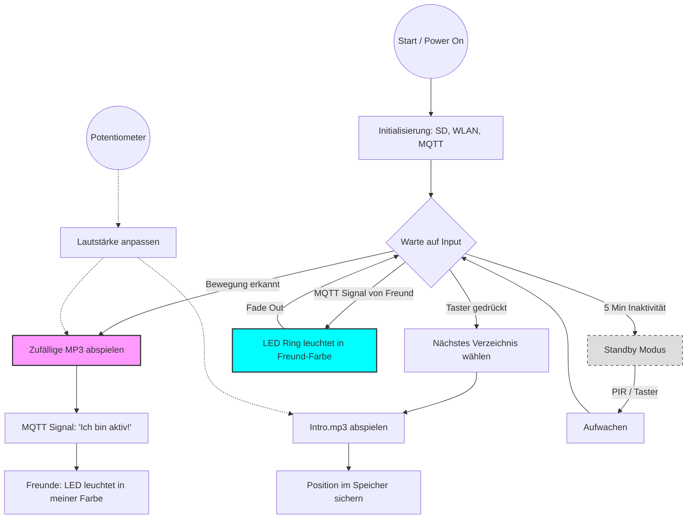

# 📖 Anwenderdokumentation: Zwitscherbox (V6)

## 1. Übersicht
Die **Zwitscherbox** ist ein smarter, verzeichnisbasierter MP3-Player. Sie reagiert auf Bewegungen, spielt entspannende Klänge ab und kann mit anderen Boxen über das Internet kommunizieren ("Freundschaftslampe").

## 2. Hardware-Elemente
*   **PIR-Sensor (Bewegungsmelder):** Startet die Wiedergabe, sobald eine Bewegung erkannt wird.
*   **Potentiometer (Drehregler):** Stufenlose Regelung der Lautstärke.
*   **Taster:** Ein kurzer Druck wechselt zum nächsten Musik-Verzeichnis auf der SD-Karte.
*   **LED-Ring:** Zeigt Status an und leuchtet in den Farben deiner Freunde auf.
*   **SD-Karte:** Speichert deine MP3-Dateien und die Konfiguration.

## 3. Einrichtung der SD-Karte
Die Box benötigt eine FAT32-formatierte microSD-Karte.

### Ordnerstruktur
Erstelle Ordner für verschiedene Themen (z.B. "Wald", "Meer").
*   Jeder Ordner kann eine `intro.mp3` enthalten, die beim Auswählen des Ordners abgespielt wird.
*   Alle anderen MP3s im Ordner werden zufällig abgespielt, wenn der Bewegungsmelder auslöst.

### Konfiguration (`config.txt`)
Erstelle eine Datei namens `config.txt` im Hauptverzeichnis der SD-Karte, um WLAN und MQTT (optional) einzurichten.
*   **WIFI_SSID / WIFI_PASS:** Deine WLAN-Zugangsdaten.
*   **FRIENDLAMP_COLOR:** Die Farbe (z.B. `FF0000` für Rot), in der die Boxen deiner Freunde leuchten sollen, wenn *deine* Box eine Bewegung erkennt.

## 4. Bedienung
1.  **Einschalten:** Sobald die Box Strom erhält, initialisiert sie sich.
2.  **Ordner wählen:** Drücke den Taster, um durch die Verzeichnisse zu schalten. Das jeweilige Intro wird abgespielt.
3.  **Wiedergabe:** Wenn der PIR-Sensor eine Bewegung erkennt, spielt die Box ein zufälliges Stück aus dem aktuellen Ordner.
4.  **Standby:** Nach 5 Minuten Inaktivität geht die Box in einen stromsparenden Standby-Modus. Sie wacht automatisch auf, wenn Bewegung erkannt oder der Taster gedrückt wird.

## 5. Besonderheit: Die Freundschaftslampe
Wenn du die MQTT-Funktion aktiviert hast, sind deine Boxen vernetzt:
*   Erkennt **deine** Box eine Bewegung, sendet sie ein Signal an deine Freunde.
*   Erkennt die Box **eines Freundes** eine Bewegung, leuchtet **dein** LED-Ring in dessen Farbe auf.

---

# 📊 Funktions-Infografik

Diese Grafik visualisiert den logischen Ablauf und die Interaktionen der Zwitscherbox.

