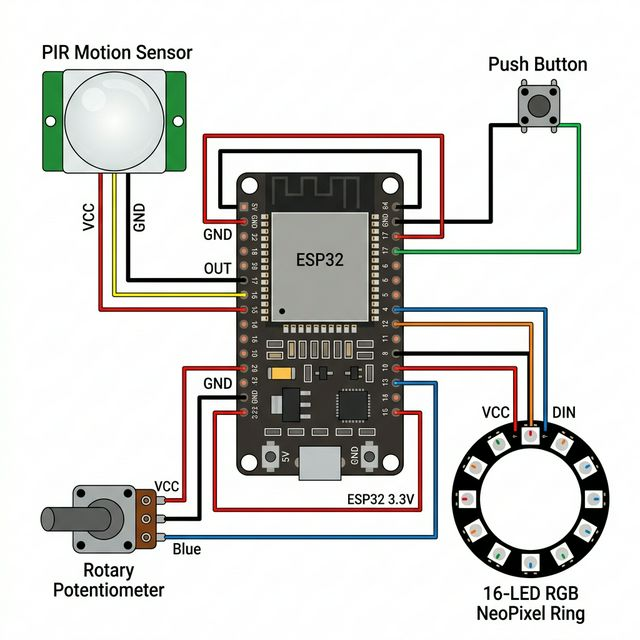
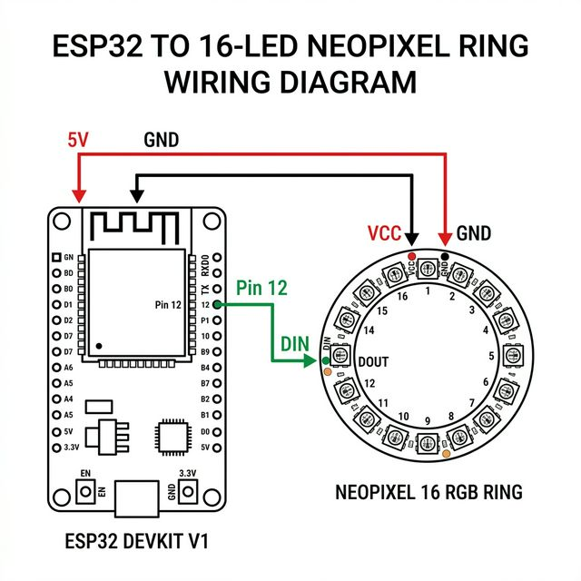

# Anschlussplan Zwitscherbox (mit Freundschaftslampe)

Dieses Dokument beschreibt die Hardwareverdrahtung der wesentlichen externen Komponenten an den ESP32 (YB-ESP32-S3-AMP) für das "Zwitscherbox"-Projekt.

## 1. Komplette Projektverdrahtung

Das folgende Diagramm zeigt den Gesamtaufbau inklusive PIR-Sensor, Taster, Potentiometer und dem NeoPixel LED-Ring.

### Pin-Belegungen in der Übersicht:

**PIR-Bewegungssensor:**
- **VCC:** 5V 
- **GND:** GND
- **OUT / Signal:** Pin 18

**Rotary Potentiometer (Lautstärke):**
- **VCC (Äußerer Pin 1):** 3.3V (Wichtig: nicht 5V nutzen, da der ADC maximal 3.3V misst)
- **GND (Äußerer Pin 2):** GND
- **OUT / Wiper (Mittlerer Pin):** Pin 4

**Push Button (Verzeichniswechsel):**
- **Erster Kontakt:** GND
- **Zweiter Kontakt:** Pin 17 *(Der Widerstand ist über den internen Pull-up im ESP32 geschaltet)*

---

## 2. Detaillierte Verdrahtung: Freundschaftslampe (LED Ring)

Die "Freundschaftslampe" besteht aus einem 16-LED NeoPixel RGB Ring (WS2812B).
Bitte beachte, dass die Datenleitung (DIN) an Pin 12 angeschlossen wird.

### Anschlussdetails LED-Ring:
- **Schwarz (GND):** An einen GND-Pin des ESP32.
- **Rot (5V/VCC):** An den 5V-Pin (oft `VBUS` oder `VIN`) des ESP32.
- **Grün (DIN):** An Pin 12 des ESP32.

*(Wichtig: Nutze auf dem LED-Ring das Pad mit der Aufschrift `DIN` oder `Data In`, nicht `DOUT`!)*
