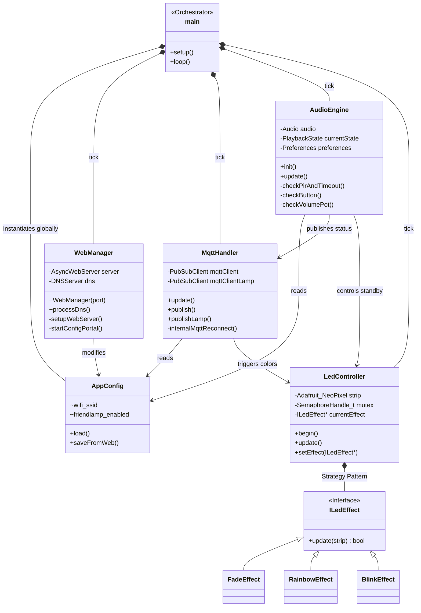
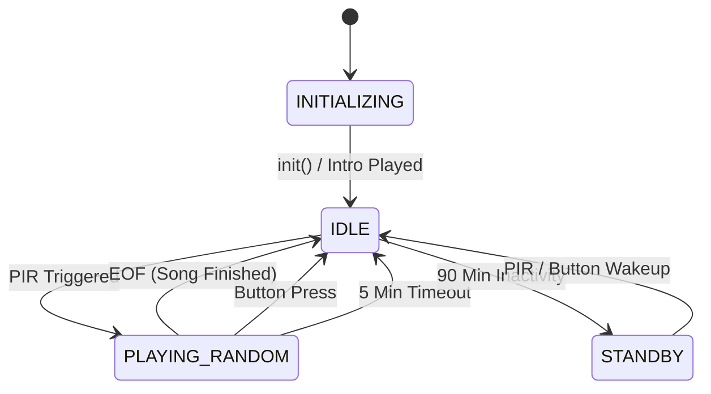

# Zwitscherbox Software Architecture

Dieses Dokument beschreibt die objektorientierte (OOP) Architektur der Zwitscherbox (Friendship Lamp) Software. Die Code-Basis wurde entwickelt, um asynchrone Hardware-Ein-/Ausgaben, Webdienste, Dual-MQTT-Kommunikation und MP3-Wiedergabe stabil miteinander zu orchestrieren.

---

## 1. Klassendiagramm & Abhängigkeiten

Das Projekt nutzt das Prinzip der **Dependency Injection**. Das bedeutet, die `main.cpp` agiert lediglich als "Dirigent" (Orchestrator). Sie erstellt die Instanzen der einzelnen Manager-Klassen und ruft kontinuierlich deren `update()` Methoden in der `loop()` Schleife auf.

---

## 2. Erklärung der Architektur (Klassen)

### 2.1 `AppConfig` (Datenhaltung)
Dies ist das Gehirn für Einstellungen. Es existiert global (`extern AppConfig config;`). 
- **Aufgabe**: Liest beim Start die Datei `/config.txt` von der SD-Karte ein und parst diese.
- Sämtliche anderen Klassen (`MqttHandler`, `WebManager`, etc.) greifen auf diese Instanz zu, um zu prüfen, ob z.B. `config.friendlamp_enabled` aktiv ist.

### 2.2 `WebManager` (Konfigurations-Portal)
Kapselt den Asynchronen Webserver (`AsyncWebServer`) und das Captive Portal (`DNSServer`).
- **Aufgabe**: Wenn keine WLAN-Verbindung möglich ist (oder über den Setup-Taster erzwungen), öffnet er ein eigens WLAN "Zwitscherbox".
- Bietet HTML-Seiten zur einfachen WLAN-, MQTT- und Farb-Konfiguration an.
- Nutzt asynchrone "Lambda-Funktionen", weshalb blockierender Code im `loop()` nicht mehr nötig ist.

### 2.3 `MqttHandler` (Netzwerk & Kommunikation)
Verwaltet simultan **zwei** MQTT-Broker:
1. Lokaler Home Assistant Broker (Steuerung / Status)
2. Externer/Öffentlicher Friendship Lamp Broker (Kommunikation mit anderen Lampen)
- **Aufgabe**: Sorgt asynchron dafür (`mqttHandler.update()`), dass die Verbindung gehalten wird. 
- Bei Empfang einer bestimmten Lampen-Nachricht übersetzt er diese in ein visuelles Signal und leitet es direkt an den `LedController` weiter.

### 2.4 `LedController` (Visuelle Effekte)
Abstraktionsschicht für den NeoPixel LED-Ring, die extrem weiche, blockierungsfreie Fades und Regenbögen ermöglicht.
- **Strategie-Muster (Strategy Pattern)**: Nutzt Effekte, die von der Basis `ILedEffect` erben. Der Controller ruft nur stumm `update()` auf. Ist der Effekt zu Ende (z.B. Fade Out), zerstört der LEDController das Effekt-Objekt automatisch aus dem Arbeitsspeicher.
- **Thread-Safety (FreeRTOS)**: Damit die asynchrone Audio-Bibliothek (`ESP32-audioI2S`) und der Webserver nicht gleichzeitig in den Speicher LEDs schreiben, wird ein "Mutex" (Semaphore) verwendet. Das verhindert Systemabstürze.

### 2.5 `AudioEngine` (State Machine & Hardware)
Die technisch komplexeste Klasse. Sie abstrahiert alle physischen Taster, den PIR Bewegungsmelder, das Poti und den I2S Verstärker. Da MP3-Dateien stoppen, starten und pausieren können, nutzt die Engine eine strikte **Zustandsmaschine (State Machine)**.

- **Features**: Merkt sich per ESP32-eigenem NVS (Non-Volatile Storage via `Preferences`), in welchem Ordner (`dirIndex`) und auf welcher Lautstärke (`volume`) der Nutzer vor einem Neustart oder Stromausfall war.
- Verhindert Mehrfachtriggering (Entprellung / Debounce).
- Kommuniziert beim Wechsel in einen neuen State sofort per MQTT den Live-Status (z.B. `"Playing Audio"`, `"PIR Triggered"`).

> [!TIP]
> **Für Erweiterungen:** Wenn du z.B. einen neuen Taster einbauen willst, musst du nur den PIN definieren und eine entsprechende `checkNewButton()` in der `AudioEngine.cpp` hinzufügen. Die anderen Komponenten bleiben davon völlig unberührt!
