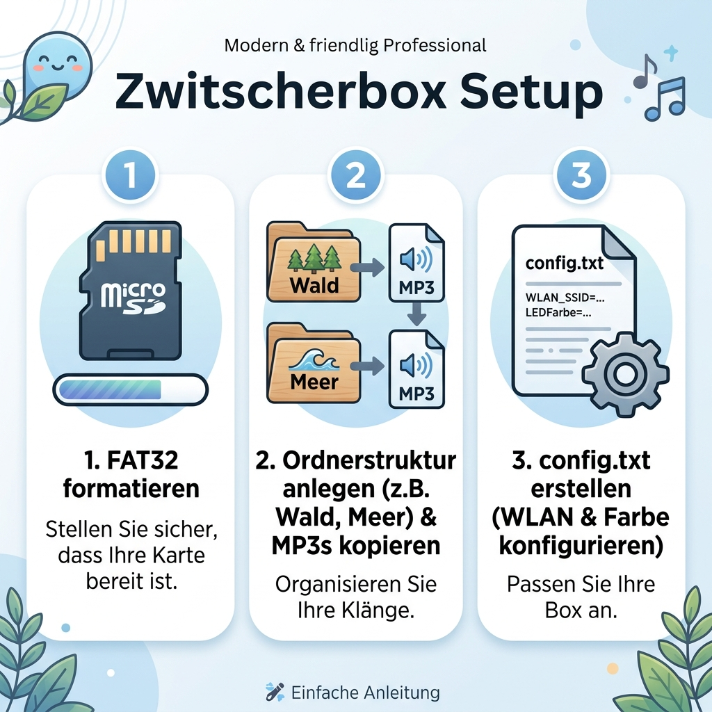
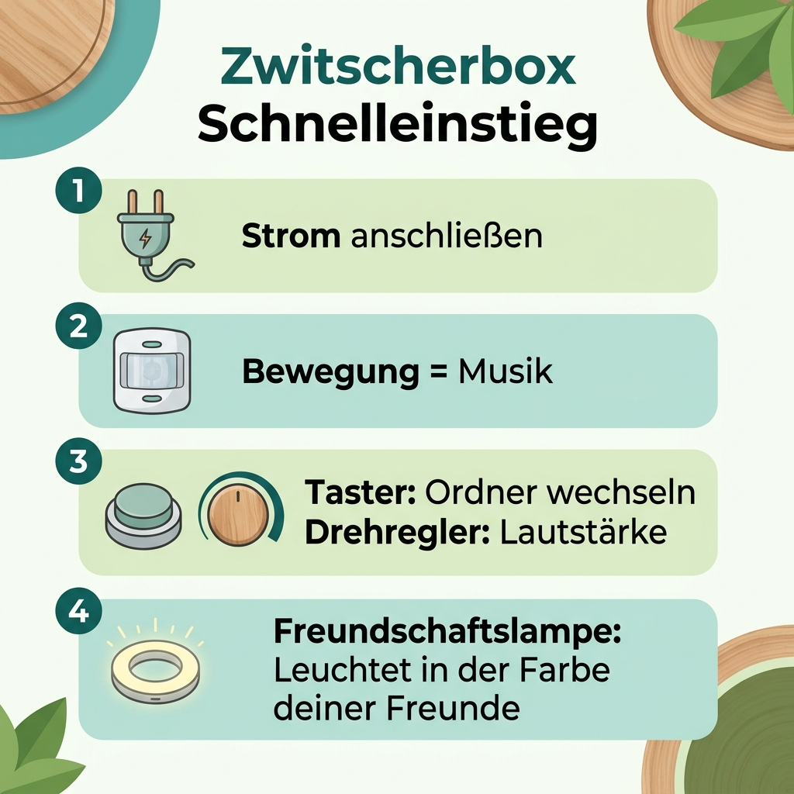

# 📖 Ausführliche Anleitung: Die Zwitscherbox

> [!NOTE]
> Willkommen zur **Zwitscherbox**! Diese interaktive und vernetzte Musikbox spielt beruhigende Klänge, wenn du den Raum betrittst – und leuchtet dank der "Freundschaftslampe" in einer speziellen Farbe, wenn deine Freunde an ihrer Box vorbeilaufen. Hier findest du alles, was du wissen musst.

---

## 🛠️ Teil 1: Vorbereitung und Setup der SD-Karte

Bevor du die Zwitscherbox in Betrieb nehmen kannst, muss die beigelegte oder eigene MicroSD-Karte vorbereitet werden. Dies stellt sicher, dass die Box deine Audio-Inhalte findet und sich mit dem Internet (WLAN & MQTT) verbinden kann.

### 1. FAT32 Formatierung
Die SD-Karte **muss** im Format `FAT32` formatiert sein. Nutze dazu das Festplattendienstprogramm an deinem Mac oder ein entsprechendes Tool an einem PC.

### 2. Ordnerstruktur und MP3s
Du kannst verschiedene "Themen" für deine Sounds anlegen. 
* Erstelle im Hauptverzeichnis Ordner wie `Wald`, `Meer` oder `Meditation`.
* Kopiere deine MP3-Dateien in diese Ordner.
* *Tipp:* Wenn du möchtest, kannst du in jeden Ordner eine Datei names `intro.mp3` legen. Diese wird immer genau dann abgespielt, wenn du manuell in diesen Ordner wechselst (siehe Teil 2).

### 3. Konfiguration (`config.txt`)
Für die Internetfunktionen (WLAN & MQTT für die Freundschaftslampe) benötigt die Box deine Zugangsdaten. Erstelle eine Datei mit dem exakten Namen `config.txt` im Hauptverzeichnis der SD-Karte:
* **WLAN_SSID**: Dein WLAN-Name (Beispiel: `WLAN_SSID=MeinWLAN`).
* **WLAN_PASS**: Dein WLAN-Passwort.
* **FRIENDLAMP_COLOR**: Die Farbe deiner Box in verhexter Schreibweise (z.B. `FF0000` für Rot). In dieser Farbe werden die Boxen deiner Freunde aufleuchten, wenn du an deiner Box vorbeigehst!

---

## 🎶 Teil 2: Schnelleinstieg & Bedienung im Alltag

Sobald die SD-Karte eingelegt ist und du die Box mit Strom versorgst, initialisiert sie sich und ist bereit. Die Bedienung im Alltag ist denkbar einfach!

### 1. Stromversorgung
Stecke die Box einfach in die Steckdose oder schließe sie an eine Powerbank an. Sobald sie hochgefahren ist, überwacht sie den Raum.

### 2. Automatische Wiedergabe (Bewegung = Musik)
Die Besonderheit der Zwitscherbox: Du musst sie nicht aktiv einschalten. Der eingebaute Bewegungsmelder (PIR-Sensor) erkennt, sobald jemand im Raum ist, und startet die Musik. Nach 5 Minuten Inaktivität schaltet sie sich diskret in den Standby-Modus, um Strom zu sparen, und wacht erst bei neuer Bewegung wieder auf.

### 3. Ordnerwahl & Lautstärke
* **Taster**: Ein kurzer Druck auf den Taster wechselt zum nächsten Sound-Ordner auf der SD-Karte (z.B. vom "Wald" wechseln zum "Meer"). Falls vorhanden, wird dabei die `intro.mp3` zur Bestätigung abgespielt.
* **Drehregler**: Die Lautstärke kannst du mit dem Regler (Potentiometer) ganz entspannt stufenlos und präzise anpassen.

### 4. Die Freundschaftslampe
Der LED-Ring an der Box ist mehr als nur Deko: Er verbindet dich mit deinen Liebsten.
* **Aktion**: Wenn *du* eine Bewegung vor deiner Box auslöst, sendet sie ein unsichtbares Signal an die Boxen deiner Freunde. So wissen diese, dass es dir gut geht.
* **Reaktion**: Umgekehrt leuchtet *dein* LED-Ring magisch in einer zugeordneten Farbe auf, sobald einer deiner Freunde seine Box auslöst. Das sorgt für ein kleines Lächeln, egal wo man gerade ist.

> [!TIP]
> **Noch Fragen?** Falls ein Fehler auftritt (z.B. falsches WLAN-Passwort), blinkt der LED-Ring typischerweise in einem speziellen Mustersignal, um auf Probleme bei der Initialisierung hinzuweisen.
