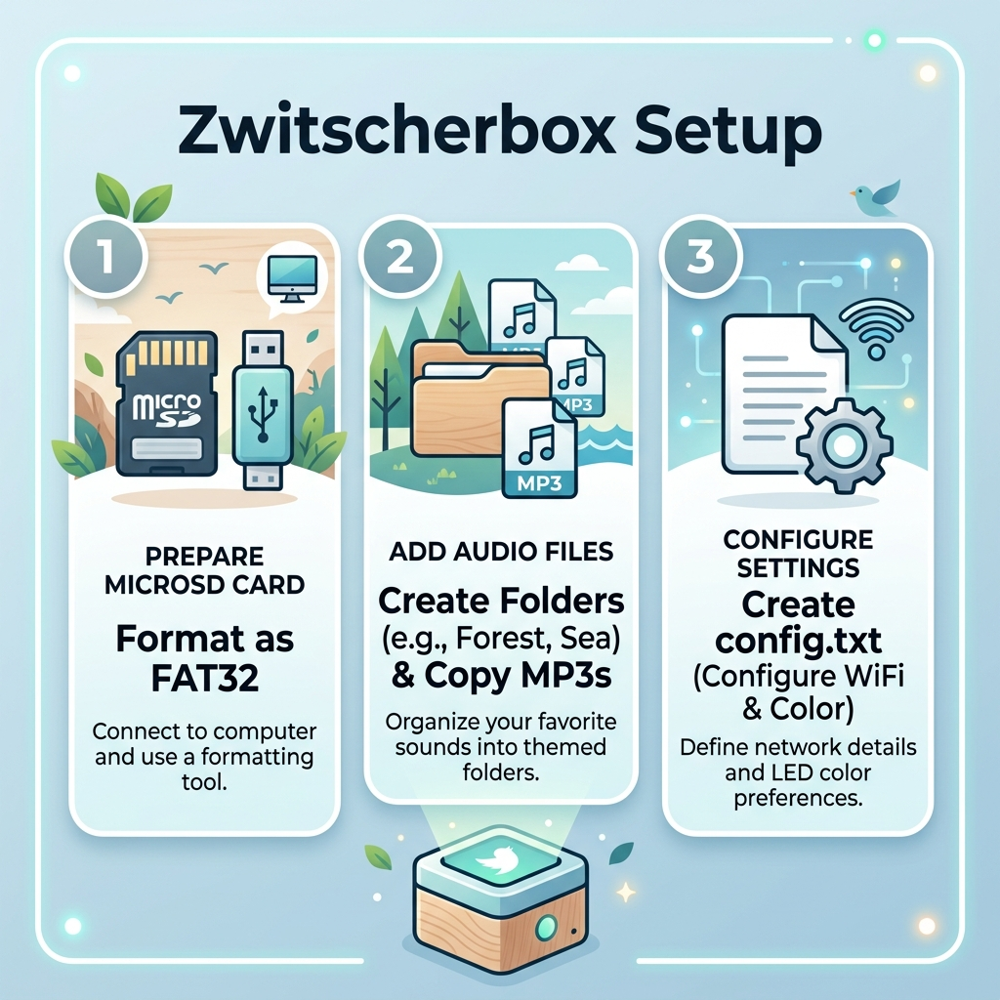
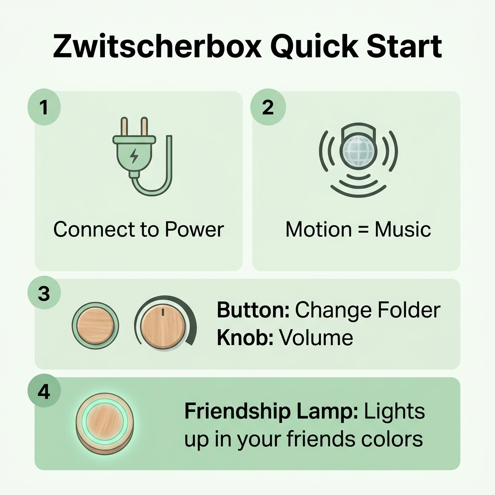

# 📖 Detailed Guide: The Zwitscherbox

> [!NOTE]
> Welcome to the **Zwitscherbox**! This interactive and connected music box plays soothing sounds when you enter the room – and lights up in a special color thanks to the "Friendship Lamp" feature when your friends walk past their box. Here is everything you need to know.

---

## 🛠️ Part 1: Preparation and SD Card Setup

Before you can start using the Zwitscherbox, the included or your own MicroSD card needs to be prepared. This ensures that the box can find your audio content and connect to the internet (WiFi & MQTT).

### 1. FAT32 Formatting
The SD card **must** be formatted in `FAT32`. You can use the Disk Utility on your Mac or a corresponding tool on a PC for this.

### 2. Folder Structure and MP3s
You can create different "themes" for your sounds. 
* Create folders in the root directory like `Forest`, `Sea` or `Meditation`.
* Copy your MP3 files into these folders.
* *Tip:* If you want, you can place a file named `intro.mp3` in every folder. This track is always played precisely when you manually switch to that folder (see Part 2).

### 3. Configuration (`config.txt`)
The box needs your login credentials for its internet features (WiFi & MQTT for the Friendship Lamp). Create a file with the exact name `config.txt` in the root directory of the SD card:
* **WLAN_SSID**: Your WiFi name (Example: `WLAN_SSID=MyWiFi`).
* **WLAN_PASS**: Your WiFi password.
* **FRIENDLAMP_COLOR**: The color of your box in HEX format (e.g. `FF0000` for red). Your friends' boxes will light up in this color whenever you walk past your box!

---

## 🎶 Part 2: Quick Start & Daily Usage

Once the SD card is inserted and you supply the box with power, it will initialize and be ready to use. Daily usage is very simple!

### 1. Power Supply
Simply plug the box into an outlet or connect it to a power bank. Once it has booted up, it monitors the room.

### 2. Automatic Playback (Motion = Music)
The special feature of the Zwitscherbox: You don't have to actively turn it on. The built-in motion sensor (PIR sensor) detects when someone is in the room and starts the music. After 5 minutes of inactivity, it discreetly goes into standby mode to save power, and only wakes up upon detecting new motion.

### 3. Folder Selection & Volume
* **Button**: A short press on the button switches to the next sound folder on the SD card (e.g. moving from "Forest" to "Sea"). If available, the `intro.mp3` is played as confirmation.
* **Volume Knob**: You can easily and seamlessly adjust the volume using the rotary knob (potentiometer).

### 4. The Friendship Lamp
The LED ring on the box is more than just decoration: It connects you with your loved ones.
* **Action**: When *you* trigger motion in front of your box, it sends an invisible signal to your friends' boxes. Thus, they know you're doing well.
* **Reaction**: Conversely, *your* LED ring magically lights up in an assigned color as soon as one of your friends triggers their box. This is meant to spread small smiles, no matter where you are.

> [!TIP]
> **Any questions?** If an error occurs (e.g. wrong WiFi password), the LED ring typically blinks in a specific pattern to indicate problems during initialization.
